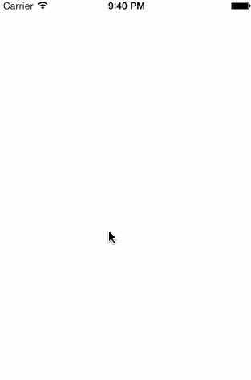

TiMWKProgressIndicator
===========================================

A minimal progress indicator for iOS with status update support. Displays above UINavigationBar and below the Status Bar.

### Usage

	var indicator = require('de.marcelpociot.mwkprogress');

	indicator.show();
	indicator.updateMessage("We're nearly done");
	indicator.updateProgress( 0.5 );
	indicator.showMessageWithColorDuration({message: 'Loading more posts...', duration: 2, color: '#789123', textColor: '#ffffff'});

## Functions

#### show

Shows the progress indicator.

#### showMessageWithColor
Option

Type: `Dictionary`

{message: 'message text', color: '#fff'}

Shows the progress indicator with specified text and color.

#### dismiss

Dismiss the progress indicator.

#### updateProgress
Option

Type: `Float`  

Progress to display from 0.0 to 1.0.

#### updateMessage
Option

Type: `String`  

Updates the displayed message.

#### showSuccessMessage
Option

Type: `String`  

Show a success indicator with the specified message.

#### showErrorMessage
Option

Type: `String`  

Show an error indicator with the specified message.

#### showMessageWithColorDuration
Option

Type: `Dictionary`  

{message: 'Loading more posts...', duration: 2, color: '#789123', textColor: '#defabc'}

Show a message indicator with the specified message, color and duration. The textColor is optional, if not specified '#000000' is used.

ABOUT THE AUTHOR
========================
I'm a web enthusiast located in Germany and in charge of http://www.titaniumcontrols.com

Follow me on twitter: @marcelpociot / @TitaniumCTRLs